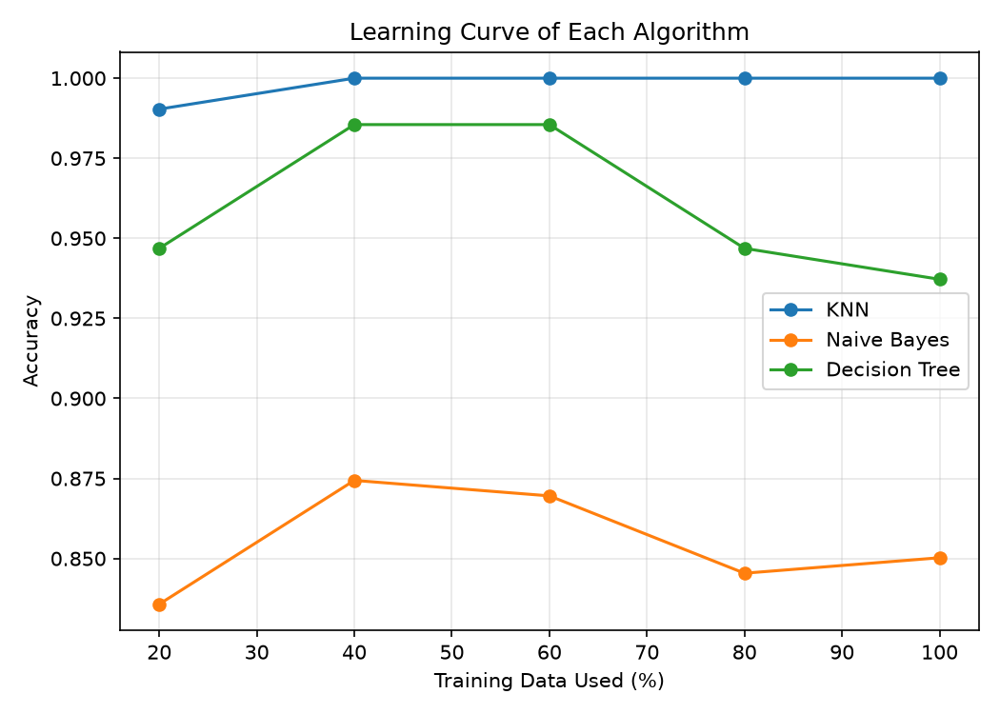
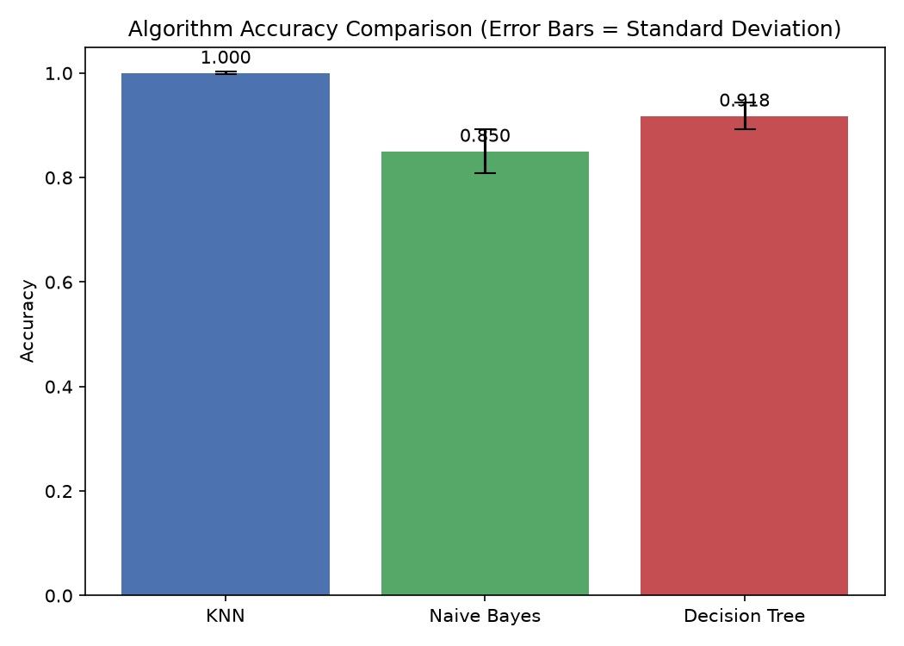

# Banknote Authentication - Machine Learning (From Scratch)

Implementation of KNN, Gaussian Naive Bayes, and ID3 Decision Tree from scratch in Python for the Banknote Authentication dataset, including 5-Fold Cross Validation, Paired t-test, and Learning Curve analysis.

---

## Project Overview

This project was developed as part of a **Machine Learning** course.

The objective is to classify **genuine** and **forged** banknotes using four numerical features extracted from wavelet-transformed banknote images.

All machine learning algorithms were implemented **from scratch** without using any machine learning libraries such as **scikit-learn**.

Implemented algorithms:

- K-Nearest Neighbors (KNN)
- Gaussian Naive Bayes
- ID3 Decision Tree

The project also includes:

- Data preprocessing
- Min-Max normalization
- 5-Fold Cross Validation
- Paired t-test statistical analysis
- Learning Curve generation
- Performance visualization

---

# Dataset

This project uses the **Banknote Authentication** dataset from the UCI Machine Learning Repository.

The dataset contains **1,372 samples** with four numerical features extracted from wavelet-transformed images of banknotes.

### Features

- Variance
- Skewness
- Kurtosis
- Entropy

### Target Labels

- **0** → Genuine Banknote
- **1** → Forged Banknote

---

## Project Structure

```text
BanknoteClassification
│
├── data
│   └── banknote_authentication.csv
│
├── preprocessing
│   ├── data_loader.py
│   ├── splitter.py
│   └── normalizer.py
│
├── algorithms
│   ├── knn.py
│   ├── naive_bayes.py
│   └── decision_tree.py
│
├── evaluation
│   ├── metrics.py
│   ├── cross_validation.py
│   ├── statistical_test.py
│   └── learning_curve.py
│
├── visualization
│   └── plots.py
│
├── project.py
├── README.md
└── requirements.txt
```

---

## Data Preprocessing

The dataset is divided into three subsets:

- **70% Training**
- **15% Validation**
- **15% Test**

The Validation set is used exclusively for **Decision Tree pruning**, while the Test set remains untouched until the final evaluation.

---

## Feature Normalization

Only the **KNN** algorithm requires feature scaling.

A manual **Min-Max Normalization** was implemented:

```text
x_scaled = (x - min) / (max - min)
```

which scales every feature into the range:

```text
[0,1]
```

---

## Implemented Algorithms

### K-Nearest Neighbors (KNN)

Implemented completely from scratch.

Features:

- Euclidean Distance
- Majority Voting
- Multiple k values
- Batch Prediction

Tested values:

```text
k = 1, 3, 5, 7
```

Workflow:

```text
Store Training Data
        ↓
Calculate Distances
        ↓
Find Nearest Neighbors
        ↓
Majority Voting
        ↓
Prediction
```

---

### Gaussian Naive Bayes

Implemented without any external machine learning library.

Training stage:

- Mean calculation
- Variance calculation
- Prior probability estimation

Prediction stage:

- Gaussian Probability
- Posterior Probability
- Class Prediction

---

### ID3 Decision Tree

Implemented from scratch using the ID3 algorithm.

Features:

- Entropy calculation
- Information Gain calculation
- Recursive tree construction
- Maximum depth = 5
- Validation-based pruning

Continuous features are discretized using their mean value.

Stopping conditions:

- All samples belong to one class.
- Maximum tree depth is reached.

---

## Evaluation Metrics

The following evaluation metrics were implemented manually:

- Accuracy
- Precision
- Recall
- F1 Score

---

## 5-Fold Cross Validation

To obtain more reliable evaluation results, a manual **5-Fold Cross Validation** procedure was implemented.

For each algorithm the following statistics are reported:

- Mean Accuracy
- Accuracy Standard Deviation
- Mean Precision
- Mean Recall
- Mean F1 Score

---

## Statistical Analysis

A **Paired t-test** is performed to compare algorithm performance.

Comparisons:

- KNN vs Naive Bayes
- KNN vs Decision Tree
- Naive Bayes vs Decision Tree

If

```text
p-value < 0.05
```

the performance difference is considered statistically significant.

---

## Learning Curve

Learning curves are generated using different portions of the training dataset:

- 20%
- 40%
- 60%
- 80%
- 100%

These curves help analyze:

- Bias
- Variance
- Underfitting
- Overfitting

---

## Final Test Results

| Algorithm | Accuracy |
|------------|----------|
| KNN | **1.0000** |
| Naive Bayes | **0.8502** |
| Decision Tree | **0.9179** |

---

## 5-Fold Cross Validation Results

| Algorithm | Accuracy (Mean ± Std) |
|------------|-----------------------|
| KNN | 0.9979 ± 0.0026 |
| Naive Bayes | 0.8406 ± 0.0424 |
| Decision Tree | 0.9521 ± 0.0260 |

---

## Paired t-test Results

| Comparison | p-value | Significant |
|------------|---------|-------------|
| KNN vs Naive Bayes | 0.00184 | Yes |
| KNN vs Decision Tree | 0.02501 | Yes |
| Naive Bayes vs Decision Tree | 0.00024 | Yes |

All comparisons resulted in **p < 0.05**, indicating statistically significant differences between the algorithms.

---

## Generated Plots

Running the project automatically generates the following figures:

### Learning Curve



---

### Algorithm Comparison



Both figures are automatically displayed during execution and saved inside the project directory.

---

# Performance Notes

This project implements all machine learning algorithms completely from scratch without using **scikit-learn**.

As a result, some operations (especially **KNN distance calculations**, **5-Fold Cross Validation**, **paired t-tests**, and **Learning Curve generation**) may take a little longer to complete compared to optimized library implementations.

Please wait until the execution finishes. During execution, the generated results and plots will be displayed and saved automatically.

---

## Installation

Install the required packages:

```bash
pip install -r requirements.txt
```

---

## Run

Execute the project:

```bash
python project.py
```

---

## Requirements

- Python 3.x
- NumPy
- Pandas
- Matplotlib
- SciPy

---

## Design Notes

To improve code readability and maintainability, all algorithms expose a common prediction interface.

Each algorithm implements:

```python
predict()

predict_batch()
```

This design allows the evaluation, cross-validation, and learning-curve modules to reuse the same interface without duplicating prediction logic.

---

## Restrictions

According to the project requirements, **scikit-learn** was **not used** for implementing any machine learning algorithm.

Only the following libraries were used:

- NumPy
- Pandas
- Matplotlib
- SciPy (only for the paired t-test)

---

## Author

**Shervin**

Machine Learning Course Project

**Banknote Authentication using KNN, Gaussian Naive Bayes, and ID3 Decision Tree implemented completely from scratch in Python.**
